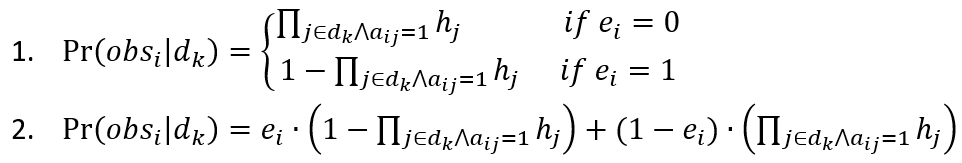
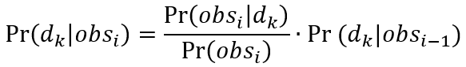
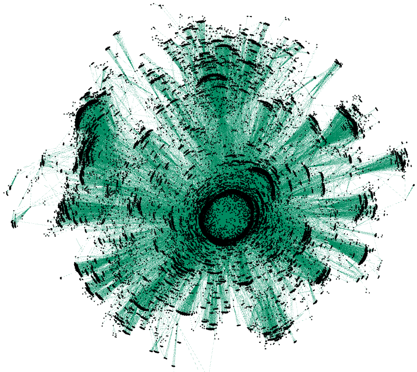
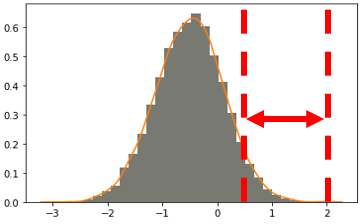
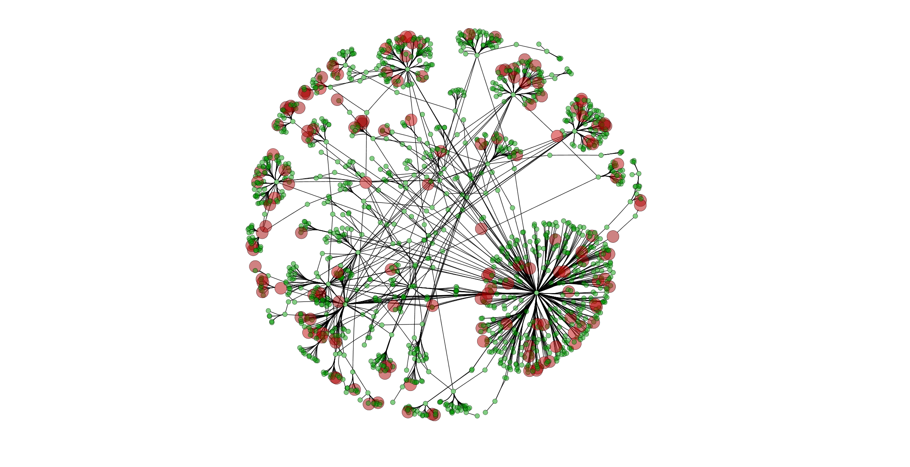
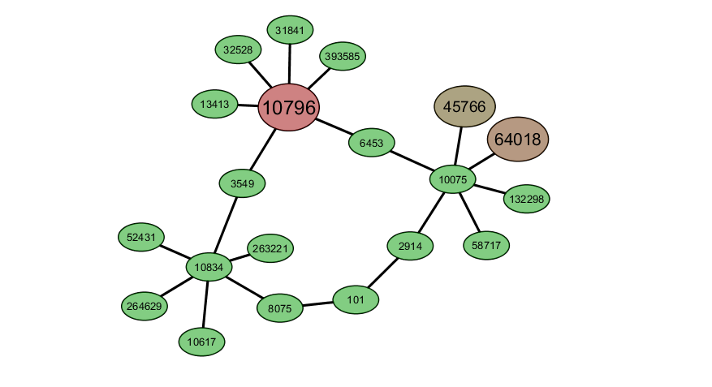
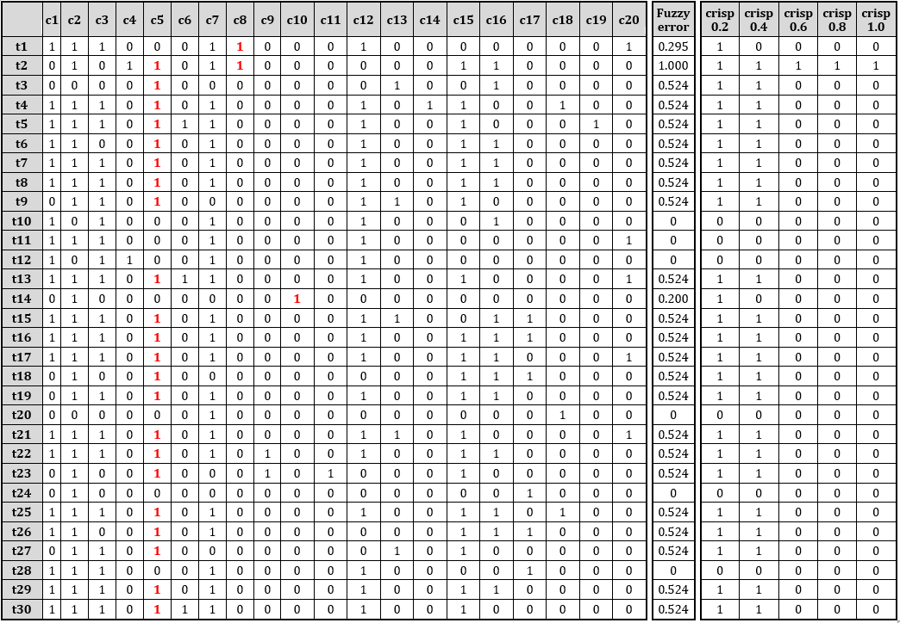
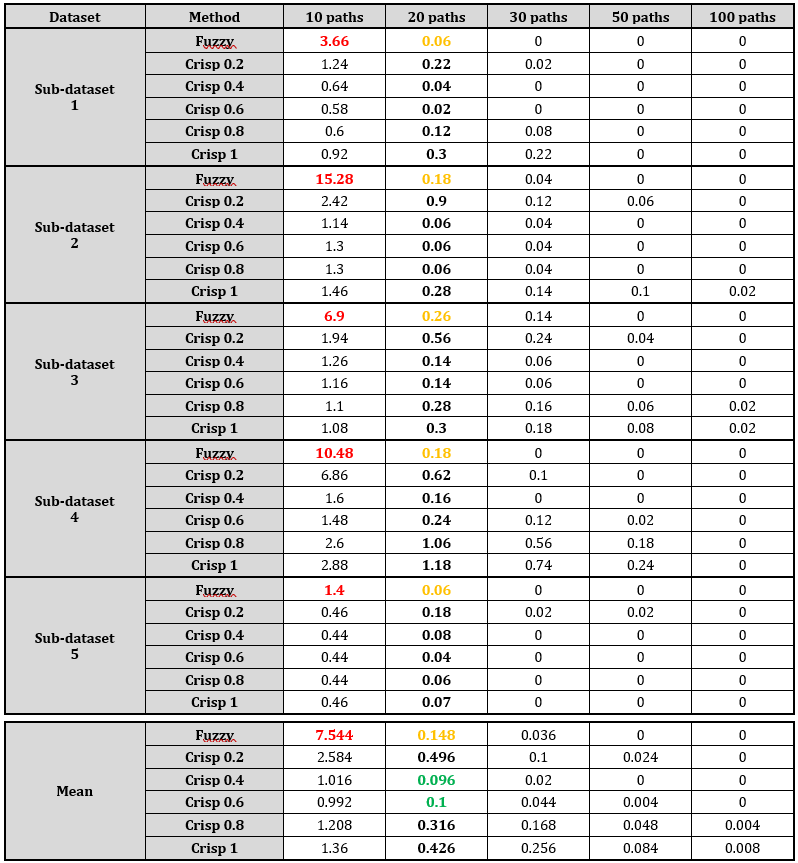
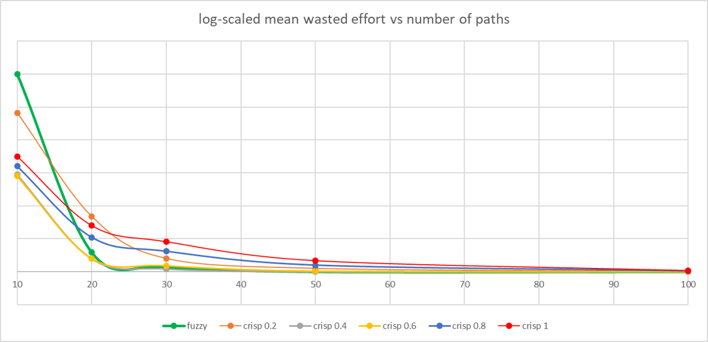
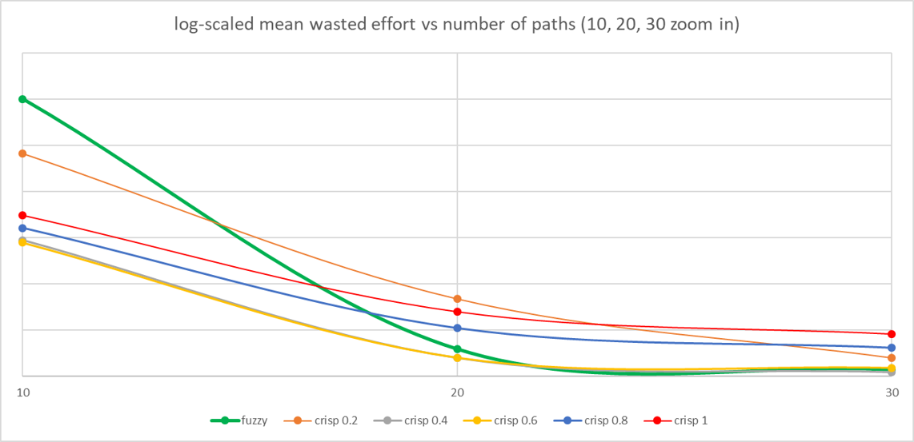

# Diagnosis of software networks delays and failures

## Introduction:

In this project I address the problem of diagnosing latencies in computer networks. 
I do it by Extending BARINEL algorithm, “Spectrum-Based Multiple Fault Localization” [Abreu et al., 2009] with fuzzy logic, according to “A Framework for Automatic Debugging of Functional and Degradation Failures” [Abreu et al., 2019], and adapting it to the computer networks domain. 
BARINEL is an algorithm which combines SFL (spectrum-based fault localization), and MBD (model-based diagnosis), which aims to rank minimal-hitting-sets, by their probability to explain the observations, i.e to be a correct diagnosis. 
The key difference between BARINEL and the fuzzy logic lies within the following equations:

I use these equations as part of the optimization problem, when trying to optimize the “health” of components, in order maximize the probability of a diagnosis to explain a set of observations:

The first equation can only differentiate between tests that were passed and tests that were failed, while the latter allows us to handle “soft” failures, like latency. 
I have implemented Fuzzy BARINEL, as well as it’s minimal-hitting-set finder, STACCATO [Abreu et al., 2009].

## Experiment and data:

In short, I compare fuzzy logic BARINEL to different crisp thresholds BARINEL, to find the best practice to use to diagnose the latency in computer networks.
This section explains how the data is created, and how the experiment is conducted. It also contains a running example to emphasize the explanation. 

Caida (Center for Applied Internet Data Analysis, www.caida.org) creates and maintains files which contain autonomous system links derived from scamper traceroute traces, for research of internet topology. Each file contains the links observed in about 24 hours, by a few monitors, which sum to about 100,000 direct links.

I used a file which consist the data recorded between 2019-06-29 07:15 AM and 2019-06-30 03:46 AM  
(http://data.caida.org/datasets/topology/ark/ipv4/as-links/team-1/2019/cycle-aslinks.l7.t1.c007532.20190629.txt.gz).

I parsed the data, extracted the links, and inferred the components. 
The graph built from the mentioned recorded data contains 32,323 nodes and 63,583 edges. In my experiment I only take into measure the largest connected component, which contains 32,090 nodes and 63,449 edges. 
Each node represents a router / switch, and each edge represent an observed link between 2 routers / switches. 
The graph is only used to simulate real Internet topology. 

The graph (the whole graph was visualized using Gephi):

The actual experiment is conducted on a random subgraph, which is constructed of 2000 random edges of the recorded file. Then, the largest connected component is extracted, and we are left with 1542 nodes, and 1739 edges. 
I inject latency to the components: 
* I create latency according to the normal distribution μ=-0.5,σ=0.62.
* I then clip the latencies by setting values smaller than 50 ms to 0 ms and values larger than 200 ms to 200 ms.
* These operations enables us to inject latency varying in range 50 ms – 200 ms to 5% of the components. 

Among the nodes of my subgraph, 83 (~5%) are injected with latency, according to the description above. 
The subgraph (visualized using Cytoscape):

Dimensions and color intensity represent latency:
- The more latency a component has, the more intense is its red color, and its size is bigger.
- Green nodes have latency under the error threshold (0.2 ms).

For the creation of the data, I create sub-datasets, containing 15-30 random (with component connectivity constraint) components. Then to create the tests I randomly choose paths among the components. The paths are constrained not to contain all abnormal components in one path, to avoid getting the solution easily.
Then I create the spectra matrix and error vector:
- An entry in spectra matrix is 1 if component (column) j is contained in a path (row) i.
- Error vector is composed of standardized accumulated latency of each of the paths.

For every sub-dataset, for every number of tests (10, 20, 30, 50, 100), tests (paths) were randomly chosen 50 times, to calculate average wasted effort of each method.

## Running example:

I will now demonstrate the whole process with one detailed running example:

The subgraph contains 20 nodes, of which 3 have abnormal latency. 
Each edge is of course a “real” link from the original data. 
The comonents are enumerated, but represent a ‘real’ component id. 
The following components are the abnormal ones: 
- 'c5': {'comp': '10796', 'latency': 1.056}
- 'c8': {'comp': '64018', 'latency': 0.712}
- 'c10': {'comp': '45766', 'latency': 0.570}

The rest of the components’ latency are 0’s.

30 paths were randomly chosen, to form the spectra and error vector:

#### The error vectors:
Fuzzy error - accumulated latency, standardized to be in range [0.2 1]: 
* 0 means no latency above threshold in the path.
* 0.2 is the lowest error which represents the latency threshold.
* 1 is the maximal accumulated latency.
* I have chosen to standardize in relation to the highest accumulated latency observed (and not highest possible accumulated latency), because it will give better distribution over the range [0.2 1]. 

The other error vectors are created with crisp thresholds – 0.2, 0.4, 0.6, 0.8, and 1 respectively. They are created to test fuzzy logic BARINEL results against crisp logic BARINEL results with different thresholds.

#### One path explanation example - test 2:
c8 has 0.712 ms latency and c5 has 1.056 ms latency. The accumulated latency of this path is 1.768, which is also the maximal accumulated latency among all paths. Thus, this value is standardized to 1.

#### I feed the spectra matrix and the error vectors (each vector at a time) into the BARINEL code, and inspect the results: 
#### The results of Fuzzy Barinel are as following:

	1. Diagnosis (5, 8, 10):      Probability: 0.7989
	2. Diagnosis (8, 10, 13, 15): Probability: 0.0910
	3. Diagnosis (5, 10, 20):     Probability: 0.0745
	4. Diagnosis (8, 10, 15, 16): Probability: 0.0098
	5. Diagnosis (2, 5):          Probability: 0.0085
    
#### The results of Barinel with crisp thresholds: 
Barinel ranked probabilities (threshold – 0.2):

	1. Diagnosis (5, 8, 10):      Probability: 0.4820
	2. Diagnosis (2, 5):          Probability: 0.1499
	3. Diagnosis (5, 10, 20):     Probability: 0.1205
	4. Diagnosis (8, 10, 13, 15): Probability: 0.0536
	5. Diagnosis (1, 5, 10):      Probability: 0.0395

Barinel ranked probabilities (threshold – 0.4):

	1. Diagnosis (2, 5):           Probability: 0.7996
	2. Diagnosis (5, 8, 10):       Probability: 0.0889
	3. Diagnosis (5, 10, 20):      Probability: 0.0889
	4. Diagnosis (8, 10, 13, 15):  Probability: 0.0099
	5. Diagnosis (10, 13, 15, 20): Probability: 0.0099

Barinel ranked probabilities (threshold – 0.6):

	1. Diagnosis (5, 8, 10):       Probability: 0.9998
	2. Diagnosis (8, 10, 13, 15):  Probability: 0.0001
	3. Diagnosis (5, 10, 20):      Probability: 0.0001
	4. Diagnosis (2, 13):          Probability: 0.0000
	5. Diagnosis (10, 13, 15, 20): Probability: 0.0000

Barinel ranked probabilities (threshold – 0.8):

	1. Diagnosis (5, 8, 10):       Probability: 0.9998
	2. Diagnosis (8, 10, 13, 15):  Probability: 0.0001
	3. Diagnosis (5, 10, 20):      Probability: 0.0001
	4. Diagnosis (2, 13):          Probability: 0.0000
	5. Diagnosis (10, 13, 15, 20): Probability: 0.0000

Barinel ranked probabilities (threshold – 1):

	1. Diagnosis (5, 8, 10):       Probability: 0.9998
	2. Diagnosis (8, 10, 13, 15):  Probability: 0.0001
	3. Diagnosis (5, 10, 20):      Probability: 0.0001
	4. Diagnosis (2, 13):          Probability: 0.0000
	5. Diagnosis (10, 13, 15, 20): Probability: 0.0000

We can observe, that by using Fuzzy BARINEL, we have found the correct diagnosis (5, 8, 10), at 1st rank, and with probability of 0.7989. 
Using crisp BARINEL with threshold 0.2 gave the same result, but with less certainty (probability of 0.482). 
The next threshold produced the correct diagnosis at 2nd rank.  
The other thresholds produced the correct diagnosis at 1st place, with high certainty. 

## Results:

The results are measured as average wasted effort in each number of paths, which were chosen randomly 50 times 
to calculate the average, in each of 4 sub-datasets. 
An average of 0 means the correct diagnosis was always ranked 1st. 
Some results are marked with bold and colors, and are discussed in the next section.

Results are log-scaled on Y-axis for visualization manners:

Zoom in on the graph between 10 and 30 paths:

* Fuzzy BARINEL performs significantly poor with 10 paths compared to crisp BARINEL.
* With 20 test I can observe:
 * Fuzzy BARINEL always performs better than crisp=0.2, the minimal latency threshold.
Setting crisp=0.2 is equivalent to treat every abnormal latency above the minimal abnormal threshold, as the same error, i.e producing error of 1. These results confirm that it would yield poor results in soft failure domains, such as network latency.
 * Fuzzy BARINEL always performs better than crisp=1.0, the maximum accumulated error.
It means that it is better than to assume that only the highest error observed produces an error 1 (which is obvious, because most of the test will not contain all the abnormal components).
 * Fuzzy BARINEL most of the time performs better than crisp=0.8.
 * crisp=0.4 and crisp=0.6 performs better than fuzzy BARINEL, but it is not significant.
* With 100 tests:
 * Crisp=1.0 and crisp=0.8 are still having some mistakes.
 * All other methods perform good – 0 wasted effort (correct diagnosis always at 1st rank).
* crisp=0.2 and crisp=1.0 always perform worse than other crisp thresholds.
* The best crisp threshold performance differs from one dataset to another. That happens because of different components, with different latencies in each dataset.

## Conclusion:

When there are at least 20 paths available, it would be a good practice to use Fuzzy BARINEL to efficiently find the correct diagnosis. 
Although it’s a compromise, when there is probably a better crisp threshold which will produce more accurate results per dataset, 
it will save the trouble of finding the best crisp threshold for each dataset. 
When there are less than 20 paths available, use crisp=0.5, which will produce descent results.

## Code:

The code is composed of 3 files:
* “STACCATO.py” which implements a low-cost, heuristic minimal-hitting-sets finder, given a spectra matrix and error vector (fuzzy or crisp).
* “BARINEL.py” which implements the fuzzy logic BARINEL (works with crisp logic as well). 
As opposed to the real algorithm described in the paper, STACCATO is outside the main method BARINEL, for ease of use in this experiment.
* “Main.ipnb” - A Jupyter notebook which imports and executes the above modules and visualizes the graphs and results.

## References:

- Statistics-directed minimal hitting set algorithm (2009, June), Abreu, R. & van Gemund. 
- Spectrum-based multiple fault localization (2009, November), Abreu, R., Zoeteweij, P. & Van Gemund.  
- A framework for automatic debugging of functional and degradation failures (2016, August), Cardoso, N., Abreu, R., Feldman, A., & Kleer.
